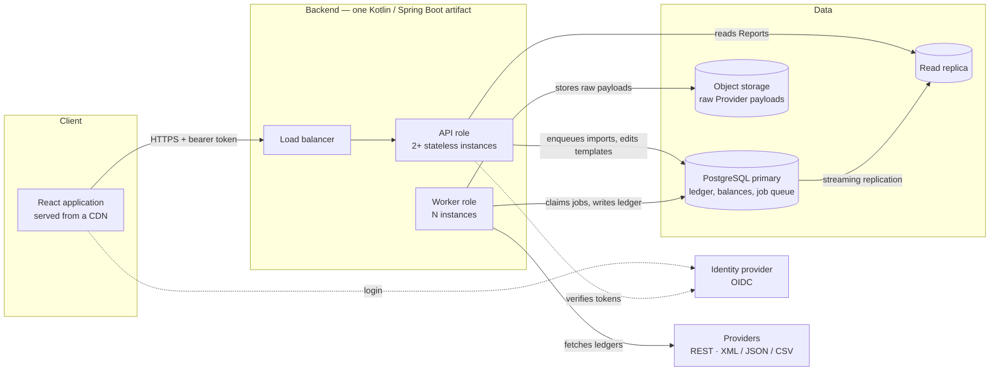
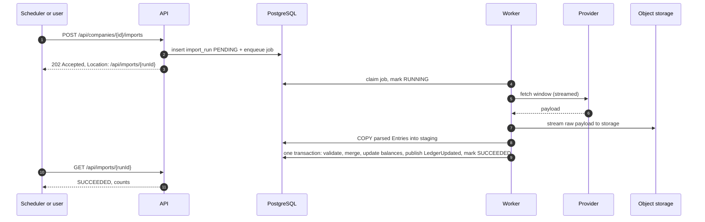

# Design dossier, part 2: architectural blueprint and performance

[Part 1](./data-and-services-model.md) set out the requirements, the scale
estimate, the data model, the service modules and the API. This part covers
how the system is deployed, which Java/Kotlin libraries build it and why, where
it will be slow, and what is deliberately left out.

Figures such as "1.2 billion Entries" and "2,000 Companies" refer to the
estimate in part 1, §3.

## 1. Blueprint

| Component          | What it does                                                                                                          | Scales by                                                    |
| ------------------ | --------------------------------------------------------------------------------------------------------------------- | ------------------------------------------------------------ |
| React application  | The SPA in this repository. Static files on a CDN                                                                     | The CDN                                                      |
| API role           | Serves the read and operations APIs. Holds no state beyond an in-memory cache, so any instance can answer any request | More instances behind the load balancer                      |
| Worker role        | Claims import jobs, calls Providers, loads and validates Entries, updates balances                                    | More instances; each runs a bounded number of jobs at once   |
| PostgreSQL primary | System of record for this service: ledger copy, balances, templates, import runs, and the job queue itself            | Vertically first; partitioning keeps large tables manageable |
| Read replica       | Serves Report reads, so imports and reads never compete on the same machine                                           | More replicas                                                |
| Object storage     | Keeps every raw Provider payload, keyed by import run                                                                 | Effectively unlimited                                        |
| Identity provider  | Signs users in and issues tokens. The backend only verifies them                                                      | Managed service                                              |

**Both roles are the same artifact**, started with a different Spring profile.
They share the domain code, and the split exists for one reason: a burst of
imports must never slow down a user opening a Report. They are scaled, and can
fail, independently.

## 2. Two flows

### 2.1 An import run

The run has two stages, and the split is deliberate.

**Stage 1 — fetch (slow, touches no database).** The worker streams the
Provider's response straight to object storage. This is where nearly all the
time goes: the worker waits on someone else's server. Because no database
connection is held while waiting, a slow Provider cannot exhaust the
connection pool, and a failed later stage can be replayed from storage without
calling the Provider again.

**Stage 2 — load (fast, one database transaction).**

1. **Parse and stage.** Read the stored payload with a streaming parser and
   `COPY` the Entries into a staging table — PostgreSQL's bulk-load path,
   roughly an order of magnitude faster than row-by-row inserts.
2. **Validate.** One set-based query:
   `GROUP BY transaction HAVING SUM(amount) <> 0`. Transactions that fail are
   written to `quarantined_transaction` and left out. Doing this in the
   database, rather than while parsing, makes it independent of payload
   order — some Providers sort by Account rather than by Transaction, so one
   Transaction's Entries can be scattered across the whole document.
3. **Merge.** The window is authoritative: Entries new in it are inserted,
   Entries whose `content_hash` changed are updated, Entries that vanished
   from it upstream are deleted. A window that has not changed produces no
   writes at all — that is what idempotent means here.
4. **Update balances.** Recompute `account_balance` for the months the merge
   touched, and only those.
5. **Commit.** Publish `LedgerUpdated(companyId, touchedMonths)` into the
   outbox, mark the run SUCCEEDED, commit. Either all of this is visible or
   none of it is.

**Why the window can be authoritative.** A Transaction has one date, so a
window defined by dates always contains whole Transactions. A window never
splits the aggregate part 1 is built around.

**Quarantine, not failure.** A few unbalanced Transactions should not block a
whole Company's import, so the run succeeds with a quarantine count that the
operations API shows. Above a threshold — say 1% of Transactions — the run
fails instead, because at that point the Provider's data or its connector is
broken, and a Report built on it would mislead.

**One run per Company at a time**, enforced by the partial unique index on
`import_run` (part 1, §4.3). Two overlapping runs for the same Company would
race on the same balance rows; across different Companies there is nothing to
race on, so runs proceed fully in parallel.

**Retries.** A Provider timeout or `5xx` retries with exponential backoff. A
parse or validation failure does not: retrying cannot fix bad data, so the run
fails with its error recorded and the raw payload kept for diagnosis.

### 2.2 Serving a Report

1. The API checks the token and the caller's grant for the Company (`404` if
   none).
2. It looks up the cache with the key
   `(company, template, templateVersion, period, ledgerVersion)`. On a hit it
   returns the Report, or `304` if the client's `ETag` still matches.
3. On a miss it reads `account_balance` from the read replica — a few thousand
   rows — places each Account in its Category, adds up, checks a
   BalanceSheet nets to zero (part 1, §4.4), stores the result and returns it.

`ledgerVersion` is kept per Company and FiscalYear, on `fiscal_year`, and
increments whenever an import touches that FiscalYear. Two things follow. A
CLOSED FiscalYear's version never moves, so its Reports stay cached while the
open year is refreshed every night. And a stale Report cannot be served even
if an eviction message were missed: its key simply stops matching.

## 3. Technology choices at a glance

| Concern              | Choice                                                                               | Rejected                                    |
| -------------------- | ------------------------------------------------------------------------------------ | ------------------------------------------- |
| Language and runtime | Kotlin 2 on JDK 25 (LTS)                                                             | Java alone                                  |
| Framework            | Spring Boot 4                                                                        | Quarkus, Micronaut, Ktor                    |
| Web layer            | Spring MVC on virtual threads                                                        | Spring WebFlux, Kotlin coroutines           |
| Module boundaries    | Spring Modulith, with its transactional event publication                            | Microservices                               |
| Database             | PostgreSQL 18                                                                        | MongoDB, Cassandra, ClickHouse (as primary) |
| Data access          | jOOQ; PgJDBC `CopyManager` for bulk loads                                            | JPA / Hibernate                             |
| Migrations           | Flyway                                                                               | Liquibase, Hibernate schema generation      |
| Background jobs      | JobRunr, storing its queue in PostgreSQL                                             | Kafka, RabbitMQ, Quartz                     |
| Provider HTTP        | Spring `RestClient`, response bodies streamed                                        | WebClient                                   |
| Parsing              | StAX (Woodstox) for XML, Jackson streaming for JSON, FastCSV for CSV                 | DOM parsing, JAXB, full-object Jackson      |
| Resilience           | Resilience4j: retry, rate limiter, bulkhead, circuit breaker per Provider            | Hand-rolled retry loops                     |
| Cache                | Caffeine in-process, `report_snapshot` table behind it                               | Redis                                       |
| Excel                | Apache POI, streaming `SXSSFWorkbook`                                                | Apache POI `XSSFWorkbook` for large exports |
| Security             | Spring Security OAuth2 Resource Server; Keycloak or a managed OIDC provider          | Sessions, home-made login                   |
| API description      | springdoc-openapi, with TypeScript types generated for the application               | A hand-maintained contract only             |
| Object storage       | Any S3-compatible store, through the AWS SDK v2                                      | Payloads in PostgreSQL `BYTEA`              |
| Observability        | Micrometer and OpenTelemetry; Prometheus and Grafana                                 | Logs alone                                  |
| Tests                | JUnit 5, Kotest assertions, Testcontainers, WireMock, Spring Modulith's module tests | An in-memory H2 database                    |
| Build and deploy     | Gradle Kotlin DSL; containers on managed Kubernetes or ECS; managed PostgreSQL       | —                                           |

## 4. The choices argued

Each decision below has the same four parts: what, why, what was rejected,
and what would change my mind. The last is the most important — a choice that
cannot say when it stops being right is a preference, not a decision.

### 4.1 A modular monolith, not microservices

**Decision.** One codebase and one artifact, divided into the seven modules
from part 1, §5. Spring Modulith verifies at build time that no module
reaches into another's internals, and that modules talk only through their
published interfaces and events.

**Why.** Microservices solve an organisational problem — many teams deploying
independently — and a scaling problem where parts of a system have very
different loads. Here there is one team, and the one real difference in load
(imports versus reads) is already handled by deploying the same artifact in
two roles. Splitting further would turn in-process calls into network calls,
and turn "import and update balances in one database transaction" into a
distributed transaction, which is exactly the guarantee this design relies on.

**Rejected.** Microservices per module: seven deployables, seven pipelines,
and eventual consistency between Ledger and Reporting for no measured gain.

**Would change my mind.** Several teams owning different modules, or one
module — most likely Connectors — needing a very different release cadence.
The module boundaries are the seams to cut along when that day comes; they
exist from the start precisely so the cut is cheap.

### 4.2 PostgreSQL as the only database

**Decision.** PostgreSQL holds the ledger copy, the balances, the templates,
the import runs and the job queue.

**Why.** Part 1, §3 puts the data at about 300 GB — well within one
PostgreSQL instance. The workload needs exactly what a relational database is
built for: grouped sums (validation, balances), exact decimals, and
multi-statement transactions so an import is all or nothing. PostgreSQL adds
the specific features this design uses: `COPY` for bulk loading, declarative
partitioning, partial unique indexes, `JSONB` for cached Reports, and
`SKIP LOCKED` for a job queue.

**Rejected.**

- **MongoDB or another document store.** Ledger data is not documents; it is
  rows that are grouped and summed across documents. Multi-document
  transactions exist but are not the model's strength, and summing becomes an
  aggregation pipeline doing what SQL does natively.
- **Cassandra.** Built for write volumes this system never reaches, at the
  price of no ad-hoc grouping and no multi-row transactions.
- **ClickHouse, or another columnar store, as the primary database.** It would
  sum billions of rows faster than PostgreSQL, but it gives up transactions and
  cheap updates, and pre-aggregation (§5) already means no Report sums
  billions of rows. It is the right second store in §6, not the right first
  one.

**Would change my mind.** Ad-hoc analytics across all Companies at once, or
Entry volumes an order of magnitude above the estimate. Both lead to §6.

### 4.3 The job queue lives in PostgreSQL

**Decision.** JobRunr, storing its jobs in the same PostgreSQL. It provides
persistent jobs, retries with backoff, recurring schedules and a dashboard.

**Why.** The load is a few thousand jobs a night — trivial for a table-backed
queue. Keeping the queue in the database means enqueuing a job and inserting
its `import_run` row happen in one transaction, so a job can never exist
without its run, or a run without its job. It is also one less piece of
infrastructure to run, secure and monitor.

**Rejected.**

- **Kafka.** Designed for millions of events per second and long-lived event
  streams. Here it would carry a few thousand messages a day, and bring
  brokers, partitions, consumer groups and a second consistency problem between
  the queue and the database.
- **RabbitMQ.** Closer in shape, but still a separate system whose delivery has
  to be coordinated with database commits.
- **Quartz.** Capable, but older, and built around triggers rather than a job
  queue with a dashboard. (`db-scheduler` is a reasonable lighter
  alternative to JobRunr.)

**Would change my mind.** Other systems needing to react to ledger changes —
at that point an event log that outlives any single consumer is a real
requirement, and Kafka fed from the outbox is the answer.

### 4.4 jOOQ, not JPA

**Decision.** jOOQ for queries, generating Kotlin types from the Flyway-built
schema; PgJDBC's `CopyManager` for bulk loads.

**Why.** The heavy work in this system is set-based SQL: bulk loads, grouped
validation, `INSERT … ON CONFLICT` merges, balance recomputation. jOOQ writes
that SQL with compile-time checking against the real schema — rename a column
and the build fails. Its open-source edition is free for PostgreSQL.

**Rejected.** JPA with Hibernate. It is designed around loading objects,
changing them, and letting the framework work out the SQL. Almost nothing here
works that way: an import writes hundreds of thousands of rows it never reads
back, and a Report is a grouped sum, not an object graph. Hibernate's
persistence context would hold every imported Entry in memory until the
transaction ends, and its generated SQL would have to be fought rather than
used.

**Would change my mind.** Nothing for the Ledger and Reporting modules. For a
future module that is plain create-read-update-delete — user administration,
say — Spring Data JDBC would be a reasonable lighter choice.

### 4.5 Spring MVC on virtual threads, not reactive

**Decision.** Blocking Spring MVC, with Java virtual threads enabled
(`spring.threads.virtual.enabled=true`).

**Why.** The worker spends most of its time waiting on Providers. Classic
thread-per-request code would need one expensive operating-system thread per
waiting call; virtual threads make each wait cost almost nothing, so a worker
can have hundreds of Provider calls in flight while the code stays plain,
sequential and easy to debug. JDBC is blocking anyway, so a reactive stack
would still need a separate thread pool for the database.

**Rejected.** Spring WebFlux, or Kotlin coroutines throughout. Both achieve
the same concurrency, at the cost of a different programming model, harder
stack traces, and reactive database drivers that jOOQ and `COPY` do not need.

**Would change my mind.** A requirement for streaming to clients — live import
progress for thousands of simultaneous watchers — where a reactive stack earns
its complexity. Server-sent events on MVC would still cover the realistic
version of that.

### 4.6 Why Kotlin, and what it buys in this domain

The brief prefers Kotlin, and the domain gives concrete reasons beyond taste:

- **Value classes** make `AccountCode` and `Money` distinct types with no
  runtime cost — the compiler rejects a raw string where an AccountCode is
  expected.
- **Sealed classes** model `ImportRun` status and `ReportKind` so that a
  `when` over them fails to compile if a case is added and not handled.
- **Null safety** in the type system: `controlAccount: AccountCode?` says in
  the type that most Accounts have none.
- **`Sequence`** gives lazy, one-at-a-time processing for the connector
  contract with no extra library.

It runs on the same JVM and uses the same libraries as Java, so nothing in
§3 is harder to use from Kotlin.

### 4.7 A cache in memory and in the database, not Redis

**Decision.** Caffeine, in each API instance, in front of the
`report_snapshot` table.

**Why.** Reports for CLOSED FiscalYears never change, and the cache key
includes both the template version and the ledger version, so an entry can
never be wrong — only unused. Caffeine answers the hot keys in microseconds;
`report_snapshot` means a new or restarted instance does not have to recompute
everything, and it survives deploys. At hundreds of users, this covers the
load with no new infrastructure.

**Rejected.** Redis. It would give one cache shared between instances, but
Report reads are rare enough (part 1, §3) that each instance recomputing a
missed Report once costs less than running, securing and monitoring another
stateful service.

**Would change my mind.** Enough API instances that duplicated computation
became measurable, or a need for shared state such as rate limiting per user
across instances.

### 4.8 Pre-aggregation in a table, not materialised views

**Decision.** `account_balance`, maintained by each import for exactly the
months it touched.

**Why.** It is incremental: an import that touches one month of one Company
rewrites a few hundred rows.

**Rejected.**

- **PostgreSQL materialised views.** `REFRESH MATERIALIZED VIEW` recomputes the
  whole view — every Company, every month — even with `CONCURRENTLY`. One
  small import would trigger a scan of a billion Entries.
- **Querying `entry` directly for every Report.** Fine for an average Company
  — a year is about 20,000 rows — but wrong for the tail: a Company posting a
  million Entries a year, or a multi-year comparison, would scan millions of
  rows per request. Pre-aggregation makes every Report cost the same.

**Would change my mind.** Reports over arbitrary date ranges rather than whole
months. Daily balances would then replace monthly ones — thirty times the rows,
still far fewer than the Entries.

## 5. Performance: where it will be slow, and what to do about it

### 5.1 The bottleneck is import

The sample Provider response records its own server-side duration: **about
twelve seconds**, for one small Company's ledger covering a few years. That
figure is the Provider's, not ours, and nothing on our side can make it
smaller. Extrapolated:

- **Nightly, done naively.** 2,000 Companies × 12 s, one after another, is
  24,000 s — **almost seven hours**, before a single row is written.
- **Onboarding, done naively.** One large Company's 30-year history in a
  single request would take many minutes, risk a timeout at the Provider, and
  leave nothing if it failed at 95%.

Reporting, by contrast, is cheap by construction (§5.3). So the design
spends its effort on import, and the first four items below are all about it.

### 5.2 Issues and solutions

**1. Provider latency — the seven-hour night.**

- **Import incrementally.** Each `provider_connection` keeps
  `synced_through`; a nightly run asks only for what changed since then, plus
  the whole OPEN FiscalYear, because Providers allow backdated corrections
  there.
- **Run in parallel across Companies.** Runs for different Companies share
  nothing (§2.1), so they are fully parallel. At 32 concurrent runs the same
  24,000 s becomes about **twelve and a half minutes**.
- **But cap each Provider.** Parallelism is bounded per Provider, not only in
  total, with a Resilience4j bulkhead and rate limiter — ten concurrent calls
  to one Provider's API may be fine, a hundred may get us blocked. A circuit
  breaker stops calling a Provider that is down, so its runs fail fast
  instead of tying up workers.

**2. Onboarding 30 years — backfill.**

- **One job per FiscalYear**, not one for the whole history. Each is small
  enough to finish, retry and resume independently; a failure in 1998 does
  not throw away 1999–2026.
- **Newest first.** Recent years are what users open, so they are usable
  within minutes while older years fill in behind.
- **A separate, low-priority queue**, so onboarding a large Company never
  delays anyone's nightly refresh.

**3. Memory — large payloads.**

- **Stream everything.** StAX, Jackson streaming and FastCSV read one element
  at a time; the connector yields a `Sequence`. Memory stays flat whether a
  payload is 5 MB or 5 GB. Parsing into a full document tree (DOM, JAXB) is
  ruled out: a 30-year XML payload can need several times its own size in
  heap.

**4. Write throughput.**

- **`COPY` into staging, then set-based merge.** Loading a million rows is a
  matter of seconds. At a conservative 100,000 rows a second, even a full
  1.2-billion-Entry backfill is a few hours of database time in total — and it
  is spread over weeks of onboarding, bounded by the Providers anyway.
- **Staging as an `UNLOGGED` table.** It skips the write-ahead log, so it is
  faster, at the cost of being emptied after a crash — harmless, because stage
  2 simply reruns from object storage.

**5. Validation needs whole Transactions.**

- **Let the database group.** Validating while parsing would require either
  sorted input or holding every open Transaction in memory. The staging table
  plus one `GROUP BY` works whatever order the Provider sends, in bounded
  memory.

**6. Recomputing balances.**

- **Only touched months.** The merge knows exactly which
  `(company, month)` pairs it changed. A nightly run normally touches one or
  two months, so it rewrites a few hundred balance rows.

**7. Report reads over a billion Entries.**

- **Read balances, never Entries.** A one-year Report reads about
  _Accounts × 12_ rows — a few thousand, independent of how many Entries sit
  underneath. A 30-year trend of one Account is 360 rows.
- **Index for it.** `account_balance` has its primary key on
  `(company_id, account_code, month)`, so a Report is a single index range
  scan.

**8. Recomputing the same Report.**

- **Closed FiscalYears are cached for good.** They change only when a
  template is edited or a correction is reimported, and both change the cache
  key.
- **Open FiscalYears are evicted on `LedgerUpdated`**, for the months it names.
- **No stampede.** When a popular template is edited, many requests may miss
  at once. Caffeine's `get(key, loader)` computes each key once per instance
  while the rest wait for that result.
- **The browser caches too.** `ETag` and `Cache-Control` let a revisited Report
  cost a `304` or nothing; the application's TanStack Query cache already
  deduplicates and reuses requests ([ADR-0005](../adr/0005-tanstack-query-owns-server-state.md),
  [ADR-0008](../adr/0008-memoization-strategy.md)).

**9. Imports slowing down reads.**

- **Reads go to a replica.** Import writes and Report reads run on different
  machines. Replication lag is seconds; data freshness is a day, so it is
  irrelevant.
- **Short write transactions.** Stage 2 is one transaction per FiscalYear
  chunk, seconds long. PostgreSQL's multi-version concurrency means readers
  are never blocked by it anyway.

**10. One huge table.**

- **Partition `entry` by `HASH(company_id)`**, into 64 partitions to start. Every query names
  one Company, so each touches one partition. Vacuuming, reindexing and
  backups work on tens of millions of rows at a time rather than a billion.
- **Not by date.** Range partitioning by year is the usual choice for time
  series, but it earns its keep by letting old partitions be dropped, and
  nothing is ever dropped here: 30 years are kept.

**11. Database connections under virtual threads.**

- **Threads are now cheap; connections are not.** Hundreds of virtual threads
  could all try to use the database at once. The HikariCP pool stays small
  (a few tens per instance), and the fetch stage (§2.1) holds no connection at
  all, so waiting on a Provider never occupies one.

**12. One Company crowding out the rest.**

- **Fairness in the queue.** One run per Company at a time, and backfill on its
  own queue, mean a single large Company can occupy at most one worker slot
  for nightly work.

**13. Large exports.**

- **Stream the workbook.** Apache POI's `SXSSFWorkbook` writes rows to disk as
  it goes and keeps only a window in memory. It matters only for exports far
  larger than a Report; an ordinary Report is a few kilobytes and is exported
  in the browser.

### 5.3 Summary

| #   | Issue                     | Solution                                                            | Effect                                    |
| --- | ------------------------- | ------------------------------------------------------------------- | ----------------------------------------- |
| 1   | Provider latency          | Incremental windows, parallel across Companies, capped per Provider | ~7 h → ~13 min a night                    |
| 2   | 30-year onboarding        | One job per FiscalYear, newest first, low priority                  | Usable in minutes, resumable              |
| 3   | Large payloads            | Streaming parsers                                                   | Flat memory at any size                   |
| 4   | Write throughput          | `COPY` to unlogged staging, set-based merge                         | ~10× faster than row inserts              |
| 5   | Scattered Transactions    | Validate with `GROUP BY` in staging                                 | Order-independent, bounded memory         |
| 6   | Balance upkeep            | Recompute touched months only                                       | Hundreds of rows per nightly run          |
| 7   | Reads over 1.2 bn Entries | Monthly balances                                                    | Thousands of rows per Report              |
| 8   | Repeated Reports          | Versioned keys, closed years cached for good                        | Most Reports never recomputed             |
| 9   | Read/write contention     | Read replica, short transactions                                    | Imports invisible to users                |
| 10  | One huge table            | Hash partitions by Company                                          | Maintenance on slices, not the whole      |
| 11  | Connection exhaustion     | Small pool, no connection held during fetch                         | Slow Providers cannot starve the database |
| 12  | Noisy neighbour           | One run per Company, separate backfill queue                        | Fair share for every Company              |
| 13  | Large exports             | Streaming workbook                                                  | Flat memory                               |

### 5.4 What to measure

Performance claims are only as good as the measurements behind them. The
worker and API export, through Micrometer:

- import duration per Provider, split into fetch and load;
- Entries per second in stage 2, and quarantined Transactions per run;
- queue depth and the age of the oldest waiting job;
- Report latency at p50, p95 and p99, and cache hit rate;
- replication lag and connection-pool wait time.

The first alert worth writing: _"the oldest nightly job has waited more than
an hour"_ — it is the earliest sign that the night will not finish.

## 6. The scaling path

What changes if the estimate is wrong by an order of magnitude:

- **10× Companies.** More workers and more API instances; perhaps 256
  partitions instead of 64. Still one primary: roughly 3 TB is large but
  ordinary for PostgreSQL on current hardware.
- **Cross-Company analytics, or 10× Entries per Company.** Add a columnar
  store such as ClickHouse as a second, read-only copy, fed from PostgreSQL's
  change stream (Debezium). PostgreSQL stays the system of record for this
  service; the columnar store only answers questions that scan everything.
- **Beyond one primary.** Shard by Company with Citus, or split Companies
  across several PostgreSQL clusters. Every query already names one Company,
  so the data model needs no change — that is the payoff of putting
  `company_id` first in every key from day one.

## 7. Deliberate omissions

Left out on purpose, so that their absence is a decision rather than an
oversight:

- **Currency conversion.** Money carries its currency and each Company reports
  in one. Consolidating Companies in different currencies needs exchange-rate
  data and rules, which the brief does not ask for.
- **Editing templates in the application.** Templates are managed through the
  operations API. A screen for accountants to edit Category trees is a product
  of its own.
- **Writing back to Providers.** This system reads ledgers; it never changes
  them (principle 1).
- **A detailed permission model.** Company-level grants with a read or admin
  role. Finer rules — per Category, per Report — are not needed yet.
- **Data retention and GDPR.** Entry labels can contain customers' and
  suppliers' names. Retention periods and erasure requests need a policy the
  business must set first.
- **Event sourcing and full CQRS.** Rejected, not forgotten. The Provider
  already holds the history of record; keeping a second event log of it would
  be an expensive duplicate.
- **Multi-region deployment and disaster recovery beyond the basics.** Managed
  PostgreSQL with point-in-time recovery, plus raw payloads in object storage
  from which the whole ledger copy can be rebuilt, are the baseline.
- **Drill-down to Entries.** The API stops at Account totals. An Entries
  endpoint for one Account and Period is a straightforward addition, served
  from `entry` with its `(company_id, account_code, posted_on)` index.
- **An implementation.** None of this backend is built in this repository;
  its stand-in writes the same API contract as static files, so the
  application would move to a real backend by changing its base URL.
