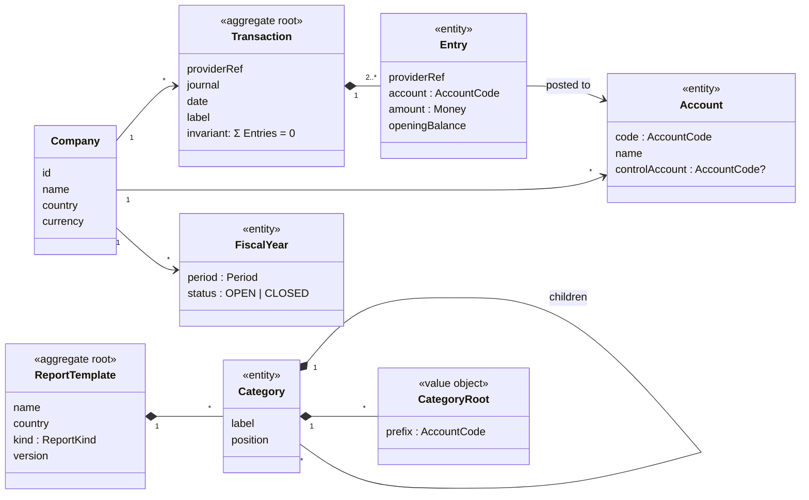
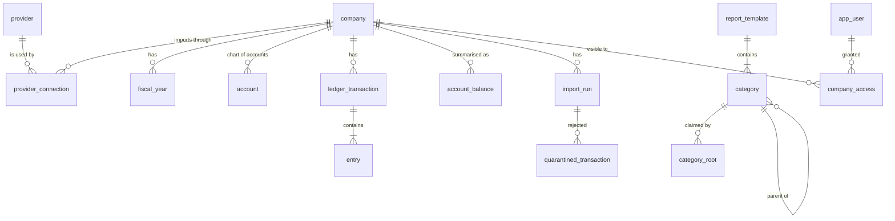
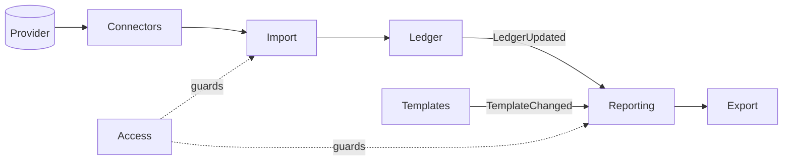

# Design dossier, part 1: requirements, data model, services model

This is the backend the brief asks to have designed: a Kotlin service that
imports general ledgers from Providers, stores them, and serves Reports to the
React application in this repository. It follows the order of a system design
review — what the system must do, how big it gets, what it stores, which
services own what, and the API between them.

[Part 2](./architecture-and-performance.md) covers the architectural
blueprint, the Java/Kotlin library choices, and the performance analysis.

The repository's build-time importer is not described here. It only stands in
for this backend so the deployed application has data to show, and the two
share exactly one thing: the [API contract](../api-contract.md).

Domain terms (Entry, Transaction, Account, Report, Category…) are used as
defined in [CONTEXT-MAP.md](../../CONTEXT-MAP.md) and its two glossaries.

## 1. The design in one minute

- **One Kotlin/Spring Boot codebase, deployed in two roles**: a stateless
  _API_ role that serves the application, and a _worker_ role that runs
  imports. Internally it is a modular monolith, not microservices.
- **PostgreSQL is the only database.** The scale estimate below comes to
  about a billion Entries and a few hundred gigabytes, which one partitioned
  PostgreSQL holds comfortably. Raw Provider payloads go to object storage.
- **Imports are asynchronous jobs.** Fetch from the Provider, stream-parse,
  load into a staging table, check that every Transaction sums to zero, then
  merge idempotently — all or nothing per run.
- **Reports never read raw Entries.** They read monthly balances per Account,
  kept up to date by each import, so the cost of a Report does not grow with
  the size of the ledger. Closed FiscalYears are cached indefinitely.
- **The bottleneck is import, not reporting.** Most of the design effort goes
  there.

## 2. Principles

Four decisions shape everything after them. Each one is argued where it
applies.

1. **The Provider is the system of record; we hold a validated copy.** The
   accounting software a Company uses owns the truth. This system keeps a
   checked replica plus summaries of it. Any table can be rebuilt by importing
   again, so re-import doubles as the recovery mechanism, and there is no need
   for event sourcing or an audit trail of our own edits — we make none.
2. **Validate at the boundary, trust inside.** The zero-sum rule is checked
   once, on the way in. Everything downstream can then rely on it — including
   the guarantee that a BalanceSheet balances (§4.4).
3. **Summaries are disposable.** Monthly balances and cached Reports are
   derived data. They can be dropped and recomputed at any time, which is what
   makes aggressive caching safe.
4. **Boring technology until the numbers say otherwise.** One relational
   database, one deployable, one job queue that lives in that database. Every
   extra moving part has to be justified by a figure from §3.

## 3. Requirements and scale

### Functional requirements (from the brief)

| #   | Requirement                                                                              |
| --- | ---------------------------------------------------------------------------------------- |
| F1  | Import accounting data from tens of Providers, over REST, as XML, JSON or CSV            |
| F2  | Store it in a database                                                                   |
| F3  | Produce at least a BalanceSheet and a ProfitAndLoss, aggregated into Categories          |
| F4  | A Category is a set of AccountCode roots (`71`, `73`, `6`…)                              |
| F5  | Every BalanceSheet balances: assets equal liabilities                                    |
| F6  | Several ReportTemplates, for different Charts of Accounts and different country rules    |
| F7  | Display a Report and export it to Excel                                                  |
| F8  | _Derived:_ see import status and failures, because imports are asynchronous              |
| F9  | _Derived:_ a user sees only the Companies they have been granted, because users are many |

### Non-functional requirements

- **Correctness beats speed.** Money is exact, never floating point. A Report
  never silently loses money: anything a ReportTemplate does not place lands
  in Unmatched.
- **Freshness of a day is enough.** Accounting is closed monthly and yearly,
  not in real time. This assumption is what allows a batch import design, and
  it is the first thing to revisit if the business says otherwise.
- **Reports feel instant.** Target p95 under 500 ms, and a cached Report
  far below that.
- **Failures stay local.** One Company's bad data, or one Provider's outage,
  must not stall anyone else's imports.
- **Every number is traceable.** For any Report figure we can say which import
  run and which raw payload it came from.

### Back-of-the-envelope estimate

The brief gives the number of Companies and years but not how many Entries a
Company posts, so that figure is an assumption, stated openly. A small company
posts a few thousand Entries a year; the design point takes ten times that as
an average, because the distribution is skewed and a few Companies will post
far more.

| Quantity                         | Assumption                                | Result                                                                      |
| -------------------------------- | ----------------------------------------- | --------------------------------------------------------------------------- |
| Companies                        | "hundreds or thousands"                   | design for 2,000, test at 5,000                                             |
| History                          | up to 30 years                            | 30                                                                          |
| Entries per Company per year     | 20,000 on average                         | —                                                                           |
| **Entries stored**               | 2,000 × 30 × 20,000                       | **≈ 1.2 billion**                                                           |
| Size per Entry, indexes included | ~250 bytes                                | **≈ 300 GB**                                                                |
| Users                            | "hundreds"                                | 500                                                                         |
| Report views                     | 50 per user per day                       | 25,000 a day — under 1 per second on average, perhaps 20 at month-end peaks |
| Imports                          | one incremental run per Company per night | 2,000 runs a night, plus one 30-year backfill per new Company               |

Three conclusions follow, and the rest of the design leans on them:

1. **Storage fits one PostgreSQL primary.** Partitioning is for maintenance
   and locality, not because one machine cannot hold the data. This is not a
   big-data problem, and it should not be given big-data infrastructure.
2. **Read traffic is tiny.** What makes a Report expensive is how many rows it
   touches, not how many requests arrive. The answer is pre-aggregation, not
   more servers.
3. **Import is bursty and dominated by waiting on Providers.** The answer is
   asynchronous jobs that run in parallel across Companies.

## 4. Data model

### 4.1 Two bounded contexts

The domain splits in two, because the same words mean different things on
each side ([ADR-0001](../adr/0001-ledger-and-reporting-bounded-contexts.md)):

- **Ledger** holds what was posted: Transactions, their Entries, the Accounts
  they were posted to. It owns the integrity of the accounting record and does
  no summarising.
- **Reporting** holds how a ledger is summarised: ReportTemplates, their
  Categories and CategoryRoots, and the Reports built from them.

The clearest example is the word **Account**. In Ledger, an AuxiliaryAccount
— one customer's or one supplier's sub-account — is a real place an Entry is
posted to. In Reporting it does not exist: it is replaced by its
ControlAccount (receivables, payables) before anything is summed. That
replacement is the **auxiliary rollup**, and it is the one translation between
the two contexts.

A third boundary sits in front of Ledger: each Provider has its own vocabulary
and payload shape, and a connector per Provider translates it into Ledger
terms. No Provider term travels further than its connector. This is an
anti-corruption layer ([ADR-0002](../adr/0002-importer-is-an-anti-corruption-layer.md)).

### 4.2 The domain model



The Domain-Driven Design terms used below are standard vocabulary, not part of
the glossary. In short: an **aggregate** is a group of objects that must
change together because a rule spans all of them; an **entity** has an
identity that outlives changes to its attributes; a **value object** is fully
described by its value and has no identity.

**Transaction is the aggregate root of Ledger.** Its rule is the zero-sum
invariant: its Entries sum to zero, or it is not valid accounting data. No
smaller unit can be judged — a single Entry, read alone, is neither right nor
wrong. So a Transaction is accepted or rejected as a whole, and the database
never holds half of one.

**Entry** is an entity inside that aggregate, identified by the Provider's own
Entry identifier. That identifier is what makes re-importing safe: the same
Entry arriving twice is recognised, not duplicated.

**Account** is an entity per Company: its Chart of Accounts. An
AuxiliaryAccount is an Account whose `controlAccount` is set; a ControlAccount
is one that other Accounts point to. Keeping this as data, rather than as
separate types, is what lets the rollup be one lookup.

**FiscalYear** carries a status. A CLOSED FiscalYear no longer changes, which
is the fact the caching strategy in part 2 is built on.

**ReportTemplate is the aggregate root of Reporting.** It owns its tree of
Categories and their CategoryRoots, because they are edited together and have
rules that span the tree: every Category sits under one parent, and a
BalanceSheet template has exactly one Result Category. Editing a template
bumps its `version`.

**Value objects:**

- **Money** — an exact decimal amount and a currency. `BigDecimal` in Kotlin,
  `NUMERIC` in PostgreSQL, a decimal string in JSON. Never a `Double`.
- **AccountCode** — a text value of variable length. Matching is always
  left-anchored text comparison, never numeric: `6` claims `606100`, and
  leading zeros and letters in auxiliary codes survive.
- **Period** — a date range. Today a Report's Period is a FiscalYear.
- **CategoryRoot** — an AccountCode prefix belonging to one Category.
- **ReportKind** — BalanceSheet or ProfitAndLoss. It decides whether
  OpeningBalance Entries count: a BalanceSheet includes them, a ProfitAndLoss
  excludes them.

In Kotlin, `AccountCode` and `Money` become `@JvmInline value class`es: the
compiler stops anyone passing a raw string where an AccountCode is expected,
at no runtime cost.

**A Report is not stored truth.** It is a read model computed from Ledger data
and a ReportTemplate. It is never edited, has no invariant of its own to
protect, and can be thrown away and recomputed. That is why it is cached
rather than modelled.

### 4.3 Tables

PostgreSQL. Company-scoped tables carry `company_id` as the first column of
their key, because every query is asked about one Company.



**Ledger — the validated copy**

| Table                 | Key columns                                                                                                                                              | Why it exists                                                                                            |
| --------------------- | -------------------------------------------------------------------------------------------------------------------------------------------------------- | -------------------------------------------------------------------------------------------------------- |
| `company`             | `id`, `slug` (unique, used in URLs), `name`, `country`, `currency`                                                                                       | The slug is stable, so a renamed Company does not break a bookmarked URL                                 |
| `provider`            | `id`, `code`, `format`                                                                                                                                   | Registry of connector types                                                                              |
| `provider_connection` | `id`, `company_id`, `provider_id`, `external_ref`, `secret_ref`, `schedule`, `synced_through`                                                            | How one Company is reached at one Provider. Credentials live in a secret store; only a reference is kept |
| `fiscal_year`         | `company_id`, `starts_on`, `ends_on`, `status`, `ledger_version`                                                                                         | OPEN or CLOSED drives caching; `ledger_version` increments when an import touches the year               |
| `account`             | `company_id`, `code`, `name`, `control_account_code`                                                                                                     | The Chart of Accounts, including AuxiliaryAccounts                                                       |
| `ledger_transaction`  | `company_id`, `id`, `provider_ref`, `journal_code`, `posted_on`, `label`, `import_run_id`                                                                | One accepted Transaction. (`transaction` is a reserved word in SQL.)                                     |
| `entry`               | `company_id`, `id`, `transaction_id`, `account_code`, `posted_on`, `amount NUMERIC(19,4)`, `currency`, `opening_balance`, `provider_ref`, `content_hash` | The largest table by far. Unique on `(company_id, provider_ref)`; partitioned by `company_id`            |

`entry.account_code` is the Account the Entry was **posted to**, an
AuxiliaryAccount included. The ledger copy stays faithful to the Provider;
the rollup happens when summarising, not when storing.

`opening_balance` is denormalised onto the Entry (it follows from the
Transaction's Journal) because Reporting filters on it constantly.

`content_hash` lets a re-import tell "same Entry, unchanged" from "same Entry,
corrected upstream" without comparing every column.

**Reporting — configuration and summaries**

| Table             | Key columns                                                                                  | Why it exists                                                                                               |
| ----------------- | -------------------------------------------------------------------------------------------- | ----------------------------------------------------------------------------------------------------------- |
| `report_template` | `id`, `slug`, `name`, `country`, `kind`, `version`                                           | `version` increments on every edit and is part of every cache key                                           |
| `category`        | `id`, `template_id`, `parent_id`, `label`, `position`, `is_result`                           | The tree: nesting through `parent_id`, order through `position`                                             |
| `category_root`   | `category_id`, `prefix`                                                                      | One row per AccountCode prefix                                                                              |
| `account_balance` | `company_id`, `account_code`, `month`, `opening_net`, `movement_net`, `entry_count`          | **The pre-aggregate.** One row per Company, reported Account and month. Reports read this and never `entry` |
| `report_snapshot` | `company_id`, `template_id`, `template_version`, `period`, `ledger_version`, `payload JSONB` | Optional second-level cache of finished Reports (part 2)                                                    |

`account_balance.account_code` is the **reported** Account: the
ControlAccount for Entries posted to an AuxiliaryAccount, the Account itself
otherwise. This is where the auxiliary rollup is applied — once, at write
time, so no Report ever sees an AuxiliaryAccount.

`opening_net` and `movement_net` are kept apart because the two ReportKinds
need different sums: a BalanceSheet adds both, a ProfitAndLoss only the
movements.

**Operations**

| Table                     | Key columns                                                                                                                                                     | Why it exists                                                                                                                                                                        |
| ------------------------- | --------------------------------------------------------------------------------------------------------------------------------------------------------------- | ------------------------------------------------------------------------------------------------------------------------------------------------------------------------------------ |
| `import_run`              | `id`, `company_id`, `trigger`, `window_from`, `window_to`, `status`, `payload_uri`, `entries_received`, `entries_accepted`, `transactions_quarantined`, `error` | One attempt to import one window for one Company. A partial unique index on `company_id WHERE status IN ('PENDING','RUNNING')` makes "one active import per Company" a database rule |
| `quarantined_transaction` | `import_run_id`, `provider_ref`, `imbalance`, `entry_count`                                                                                                     | Transactions rejected for not summing to zero, with the amount by which they fail                                                                                                    |
| `app_user`                | `id`, `subject` (from the identity provider)                                                                                                                    | Users are authenticated elsewhere; this only links them to grants                                                                                                                    |
| `company_access`          | `user_id`, `company_id`, `role`                                                                                                                                 | Which Companies a user may see                                                                                                                                                       |

**Choices worth defending**

- **`NUMERIC(19,4)`, not integer cents.** Integer minor units are marginally
  faster to sum, but currencies differ in how many decimals they have, and
  Reports sum thousands of balance rows, not millions of Entries — the speed
  difference never shows. Four decimals leave room for three-decimal
  currencies.
- **AccountCode as `TEXT`.** Codes vary in length, can start with a zero, and
  AuxiliaryAccount codes contain letters. A number type would destroy all
  three.
- **A relational database.** The data is tabular, the core rule is relational
  (sum Entries grouped by Transaction), summarising is what SQL was built for,
  and an import must be all or nothing, which needs real transactions. The
  alternatives are argued in part 2.

### 4.4 Why every BalanceSheet balances

The brief requires assets to equal liabilities. In this design that is a
consequence, not a separate check:

1. Every stored Transaction sums to zero — enforced at import (§5, Ledger).
2. So all Entries of a Company, summed over any complete set of Transactions,
   sum to zero.
3. Those Entries split into balance-sheet Accounts and revenue/expense
   Accounts. So the balance-sheet side equals minus the revenue/expense side.
4. The revenue/expense side is exactly the **Result**. A BalanceSheet shows the
   Result as its own Category, so its Categories net to zero: assets equal
   liabilities plus equity plus Result.

The Reporting service still asserts it on every BalanceSheet it builds. If it
ever fails, the ledger copy is incomplete — a missing OpeningBalance, a
FiscalYear only half imported — and the Report is refused with an error
rather than shown wrong.

### 4.5 How a Report is computed

For a Company, a ReportTemplate and a Period:

1. **Read balances.** Sum `account_balance` rows for the Company over the
   months of the Period, one total per reported Account. A BalanceSheet adds
   `opening_net + movement_net`, a ProfitAndLoss only `movement_net`. That is
   at most a few thousand rows, however large the ledger underneath.
2. **Place each Account.** Match it against the template's CategoryRoots; the
   longest matching prefix wins, so the Account lands in exactly one Category,
   the deepest that claims it. With a few hundred Accounts and a few hundred
   roots, this runs in memory in well under a millisecond.
3. **Collect what is left.** Accounts within the template's Scope that no
   Category claimed go to Unmatched. It is always present, even when empty, so
   a gap in a template shows up as a figure instead of vanishing.
4. **Add up.** Each Category's total is its children's totals plus its own
   Accounts.
5. **Check.** For a BalanceSheet, assert the net is zero (§4.4).

## 5. Services model

The backend is divided into seven modules. They run in one process — the case
against microservices is in part 2 — but each owns its own tables, exposes a
small interface, and changes for its own reasons.



| Module         | Owns                                                                               | Does                                                                                                                                                                  | Changes when                                       |
| -------------- | ---------------------------------------------------------------------------------- | --------------------------------------------------------------------------------------------------------------------------------------------------------------------- | -------------------------------------------------- |
| **Connectors** | `provider`, `provider_connection`                                                  | One adapter per Provider: authentication, pagination, rate limits, parsing XML/JSON/CSV. Emits Ledger-shaped Entries. The anti-corruption layer                       | A Provider is added or changes its API             |
| **Import**     | `import_run`                                                                       | Schedules and triggers runs, enforces one run per Company at a time, retries, records outcomes                                                                        | Scheduling or retry policy changes                 |
| **Ledger**     | `ledger_transaction`, `entry`, `account`, `fiscal_year`, `quarantined_transaction` | Validates the zero-sum invariant, quarantines what fails, merges idempotently. The only writer of Ledger tables. Publishes `LedgerUpdated` with the months it touched | Accounting rules change                            |
| **Templates**  | `report_template`, `category`, `category_root`                                     | Creates and edits ReportTemplates, checks the tree is well formed, bumps `version`. Publishes `TemplateChanged`                                                       | Accountants change how they want things summarised |
| **Reporting**  | `account_balance`, `report_snapshot`                                               | Keeps monthly balances current on `LedgerUpdated`, builds Reports, caches them, evicts on either event                                                                | Report shape or the aggregation rules change       |
| **Export**     | —                                                                                  | Renders a Report as an Excel workbook                                                                                                                                 | The spreadsheet format changes                     |
| **Access**     | `app_user`, `company_access`                                                       | Checks that the caller may see a Company, on every request                                                                                                            | The permission model changes                       |

**The brief's four responsibilities map onto these modules:**

| Responsibility | Module                  | Why it is separate                                                                                                                                   |
| -------------- | ----------------------- | ---------------------------------------------------------------------------------------------------------------------------------------------------- |
| Import         | Connectors + Import     | A Provider's payload shape changes for reasons unrelated to accounting                                                                               |
| Validation     | Ledger                  | The zero-sum rule is the same for every Provider. A new Provider needs a new connector and the same validation; a stricter rule changes no connector |
| Aggregation    | Reporting (+ Templates) | The only place that knows what a ReportTemplate is. Ledger never does                                                                                |
| Export         | Export                  | It acts on a finished Report, never on the ledger                                                                                                    |

**The connector contract** is the one interface that grows with the business
— tens of Providers means tens of implementations:

```kotlin
interface LedgerConnector {
    val provider: ProviderCode

    /** Streams one Company's Entries for a window, already in Ledger terms. */
    fun fetch(connection: ProviderConnection, window: Period): Sequence<IncomingEntry>
}
```

`Sequence` matters: the connector yields Entries one at a time as it parses,
so a 30-year payload never sits in memory whole.

**How modules talk.** Reads are plain in-process calls. Changes are announced
as events — `LedgerUpdated(companyId, touchedMonths)` and
`TemplateChanged(templateId, version)` — published in the same database
transaction as the change that caused them (the transactional-outbox
pattern). If the process dies between the commit and the handler, the event
is still delivered on restart, so a cache can never be left stale by a crash.

**Export runs in the browser today.** A Report is a few kilobytes of JSON that
the application already holds, so building the workbook client-side costs
nothing and needs no round trip. The backend offers the same Report as `.xlsx`
for the cases a browser cannot cover: scheduled or emailed exports, and
exports of detail far larger than one Report.

## 6. API

Two groups. The **read API** is what the application in this repository uses
today. The **operations API** covers imports and templates; it is designed
here but has no screen yet.

### Read API

Specified in full, payloads and rules, in [docs/api-contract.md](../api-contract.md).
That document is normative and not repeated here.

| Method and resource                                             | Returns               |
| --------------------------------------------------------------- | --------------------- |
| `GET` companies                                                 | `CompaniesIndex`      |
| `GET` companies/`{companyId}`/templates                         | `ReportTemplateIndex` |
| `GET` companies/`{companyId}`/reports/`{templateId}`/`{period}` | `Report`              |

The backend serves these at the same paths as the static files, so the
application changes nothing but its base URL. On a clean slate they would sit
under `/api/` beside the operations API, without the `.json` suffix; keeping
the static paths is a compatibility choice, and a one-line change in the
application's contract module if it is ever dropped. Beyond the static
version:

- **Excel by content negotiation.** The same Report URL with
  `Accept: application/vnd.openxmlformats-officedocument.spreadsheetml.sheet`
  returns the workbook. One resource, two representations.
- **Caching headers.** Every Report carries an `ETag` built from the template
  version and the FiscalYear's `ledger_version`. A Report for a CLOSED FiscalYear
  is also sent with a long `Cache-Control: private, max-age`; one for an OPEN
  FiscalYear is revalidated, and answered with `304 Not Modified` when nothing
  changed.
- **Not found, rather than forbidden.** A Company the caller has no access to
  returns `404`, not `403`, so its existence does not leak.

### Operations API

| Method and path                           | Success                                          | Notes                                                                                                                                 |
| ----------------------------------------- | ------------------------------------------------ | ------------------------------------------------------------------------------------------------------------------------------------- |
| `POST /api/companies/{companyId}/imports` | `202 Accepted`, `Location: /api/imports/{runId}` | Starts an import. Returns at once: an import takes seconds to minutes. `409` with the active run's location if one is already running |
| `GET /api/imports/{runId}`                | `200 ImportRun`                                  | Status, counts accepted and quarantined, error. The application polls this                                                            |
| `GET /api/companies/{companyId}/imports`  | `200` page of `ImportRun`                        | History, cursor-paginated, newest first                                                                                               |
| `GET /api/report-templates`               | `200` list                                       | Filterable by `country`                                                                                                               |
| `POST /api/report-templates`              | `201 Created`                                    | Validated as a whole tree                                                                                                             |
| `PUT /api/report-templates/{templateId}`  | `200`                                            | Requires `If-Match: <version>`; `412` if someone else edited it first                                                                 |

```json
{
  "id": "run_01J9",
  "companyId": "acme-freight",
  "status": "SUCCEEDED",
  "window": { "from": "2016-01-01", "to": "2016-12-31" },
  "entriesReceived": 20412,
  "entriesAccepted": 20398,
  "transactionsQuarantined": 3,
  "startedAt": "2026-09-22T02:00:04Z",
  "finishedAt": "2026-09-22T02:00:31Z"
}
```

**Why `202` and not `200`.** An import waits on a Provider that can take
seconds for a small ledger and much longer for a large one. Holding an HTTP
request open that long ties up a connection, collides with proxy timeouts,
and loses the result if the browser tab closes. `202` hands back a run to
watch; the work happens on a worker whatever the client does next.

**Idempotent by design.** A `POST` that races an active run gets that run back
instead of starting a second one. Re-importing a window that was already
imported changes nothing (part 2, §2.1).

**Errors** keep the existing `{ "message": string }` body, so the application
handles backend errors exactly as it handles the static ones.
